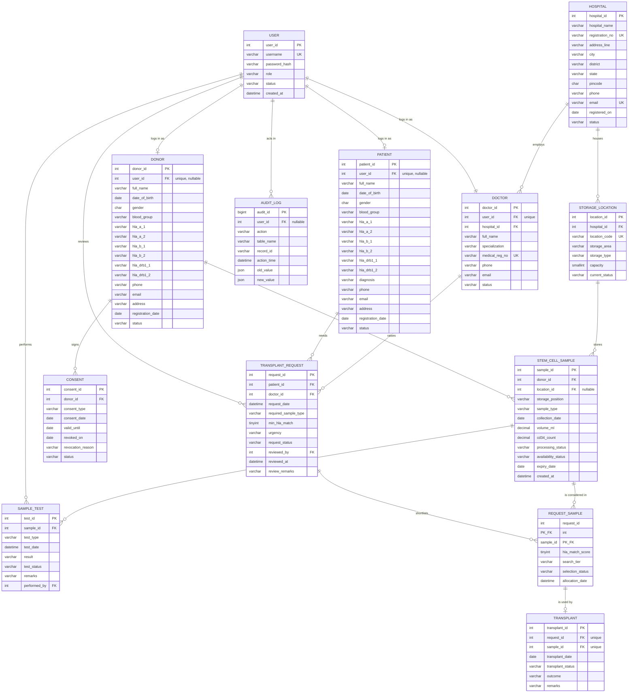
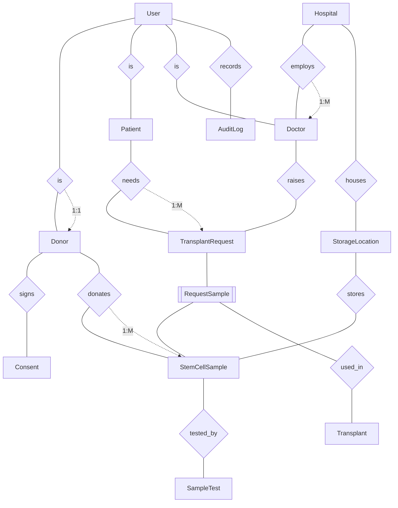

# StemVault — ER diagrams

Both diagrams below are written in [Mermaid](https://mermaid.live). Paste the code block into
<https://mermaid.live> (or any Markdown viewer that supports Mermaid, such as VS Code with the
Markdown Preview Mermaid extension) and export a PNG or SVG for the report.

---

## 1. Crow's-foot diagram (relational view)

### Reading the cardinalities

| Relationship | Cardinality | Participation |
|---|---|---|
| User – Donor / Patient | 1:1 | both optional (a donor may have no login) |
| User – Doctor | 1:1 | every doctor must have an account |
| Hospital – Doctor | 1:M | a doctor belongs to exactly one hospital |
| Hospital – StorageLocation | 1:M | a tank belongs to exactly one hospital |
| Donor – Consent | 1:M | a consent belongs to exactly one donor |
| Donor – StemCellSample | 1:M | a unit comes from exactly one donor |
| StorageLocation – StemCellSample | 1:M | a unit may be unstored (`location_id` is nullable) |
| StemCellSample – SampleTest | 1:M | a test belongs to exactly one unit |
| Patient – TransplantRequest | 1:M | over time; only one may be open at a time (enforced by a trigger) |
| Doctor – TransplantRequest | 1:M | |
| TransplantRequest ↔ StemCellSample | **M:N** | resolved by RequestSample |
| RequestSample – Transplant | 1:1 | a transplant uses exactly one shortlisted candidate |
| User – SampleTest / TransplantRequest / AuditLog | 1:M | performed_by, reviewed_by, audit user |

---

## 2. Chen-style diagram (conceptual view)

Rectangles are entities, diamonds are relationships, and the double rectangle is the associative
entity that resolves the M:N relationship.

### Notes for the viva

* **Weak entities.** `SampleTest` cannot exist without its sample and `Consent` cannot exist without
  its donor. In Chen notation they are weak entities with identifying relationships and the partial
  keys `(test_type, test_date)` and `(consent_type, consent_date)`. In the relational schema each one
  gets a surrogate primary key, and the partial key survives as a UNIQUE constraint.
* **Associative entity.** `RequestSample` carries its own attributes (HLA score, search tier,
  selection status, allocation date), so it is an entity in its own right, not a plain link table.
* **Aggregation.** `Transplant` refers to the *relationship* between a request and a sample, not to
  each of them separately. That is why its foreign key is the composite
  `(request_id, sample_id) → RequestSample`, which makes it impossible to transplant a unit that was
  never shortlisted for that request.
* **Multivalued attribute, flattened.** HLA typing is two alleles at each of three loci. The size is
  fixed and every position has its own meaning, so six columns keep the design in 1NF without an
  extra table.
* **Derived attributes, not stored.** Age comes from the date of birth, storage occupancy from
  counting units, and a sample's blood group from its donor.
